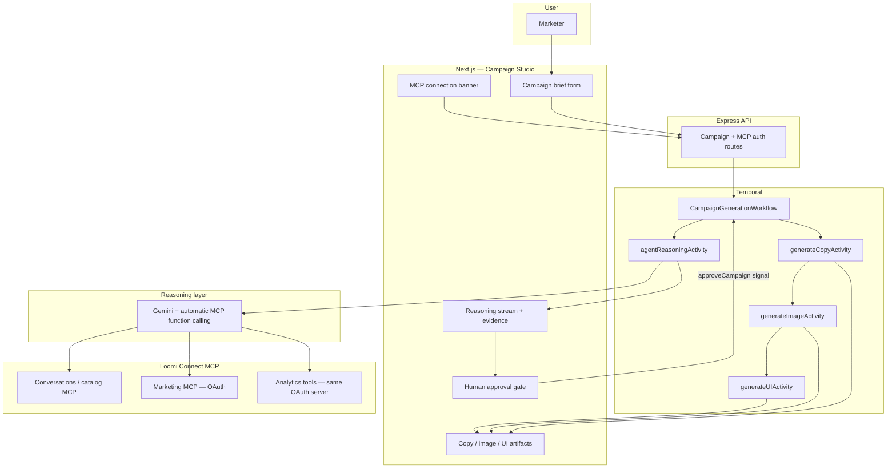
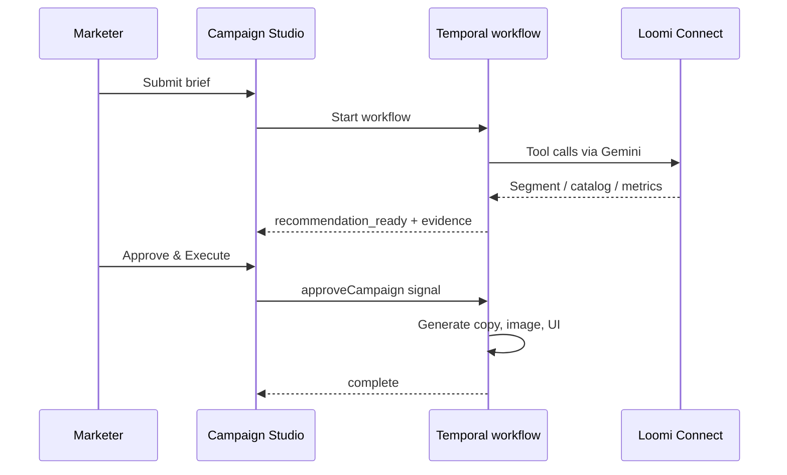

# Architecture Overview — Campaign Studio

## System context

**Export for submission:** [architecture-diagram.png](./architecture-diagram.png) · [architecture-diagram.pdf](./architecture-diagram.pdf) · [architecture-diagram.svg](./architecture-diagram.svg)

## Request flow

1. **POST `/api/campaigns`** — starts `CampaignGenerationWorkflow`.
2. **Phase 1 — Reasoning** (`agentReasoningActivity`):
   - `connectMcpClients()` → Conversation MCP + Marketing/Analytics MCP (if OAuth complete).
   - Gemini `mcpToTool` with up to 12 automatic tool calls.
   - Returns `reasoningStream`, `evidence`, `recommendedVibe`, `copyPreviewBlurb`, `usedLiveMcp`.
3. **Phase 2 — Recommendation** — workflow status `recommendation_ready`; blocks on `approveCampaign` signal.
4. **Phase 3 — Act** — copy → image → UI activities (no MCP required; uses approved strategy).
5. **GET `/api/campaigns/:id/progress`** — SSE updates for the UI.

## Key components

| Layer | Location |
|-------|----------|
| UI | `frontend/src/components/CreativeStudioWorkspace.tsx`, `McpConnectionBanner.tsx` |
| API | `backend/src/api/routes/campaignRoutes.ts`, `mcpAuthRoutes.ts` |
| Workflow | `backend/src/workflow/campaignGenerationWorkflow.ts` |
| MCP connect | `backend/src/mcp/connect.ts`, `oauthProvider.ts` |
| Agent prompt | `backend/src/mcp/reasoningPrompt.ts` |
| Reasoning | `backend/src/activity/reasoningActivity.ts` |

## Data flow

- **Into the agent:** campaign brief fields only (brand, goal, audience, platform, vibe) + MCP tool responses from sandbox.
- **Out of the agent:** structured JSON strategy, streamed reasoning lines, evidence bullets.
- **Stored:** Temporal workflow state; generated assets under `backend/.generated-assets/` when applicable.
- **Not stored:** production PII; OAuth tokens in `backend/.mcp-oauth/session.json` (local, gitignored).

## Human approval

## Production next steps

See [FUTURE_ROADMAP.md](./FUTURE_ROADMAP.md).

## Known limitations

- Analytics and Marketing share one MCP endpoint in this build (`MCP_MARKETING_URL`); separate `MCP_ANALYTICS_URL` supported via env.
- Asset generation does not push campaigns into Engagement.
- Demo fallback segment heuristics activate only when no live MCP + Gemini path is available.
